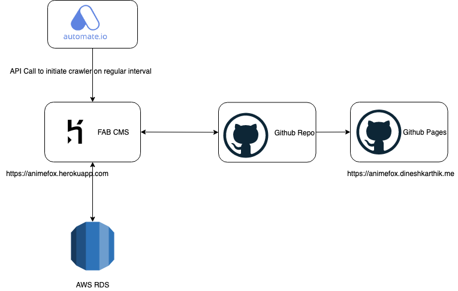

# Animefox

App to keep tabs on the new episodes/seasons of the animes I follow.

This architecture  involves  three major components:
- CMS built using Flask APP Builder (FAB)
- Animefox Web UI
- Animefox Github repo

## CMS - https://animefox.onrender.com

> username: guest  
password: guest

Guest user with viewing previlages.

The CMS (Content Management System) is built using FAB, the DB is hosted in AWS RDS. It also contains the `web crawler` that crawls and get the latest episodes of the active animes.

The crawler is intiated via API - Automate.io is scheduled bots are used to make the API call on regular intervals. When a new anime epsiode is found the DB is updated and an email newsletter is send out and the end the json data used by animefox web ui is updated in the github repo. `data/active.json` and `data/list.json`

Sample Email newsletter:

> Create an issue or email to animefox@dineshkarthik.me to subscribe to the newsletter

## Animefox WEB UI - https://animefox.dineshkarthik.me

The Web UI is the end user webpage where one can see the list of all active/currenlty ongoing websites as well as a list of all animes available in the CMS.

This web UI is entinerly hosted on GITHUB - GitHub Pages. This is the reason for stroing the json data in this Repo itself. As the json data won't change quite often may be once or twice a day and if it is served from herokuapp there will be some latency when someone tries to access the web ui after the heroku dyno goes to sleep.

